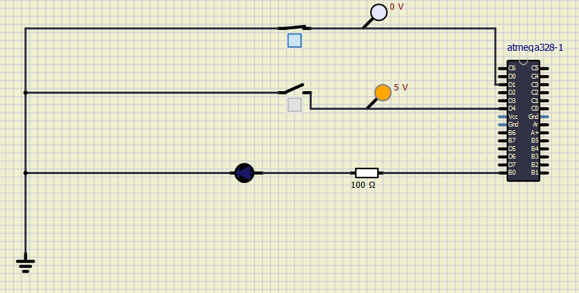
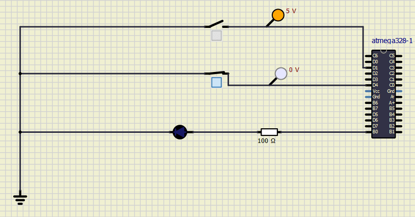
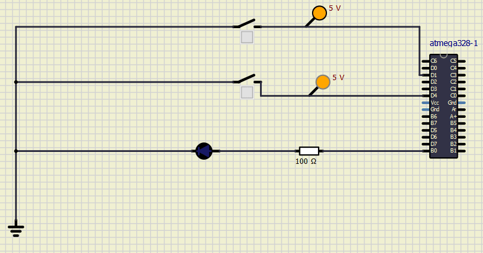

# Embedded C Activity 1

# LED Blinking 

## In Action

### Case 1 [1,1] :: LED GLOWS

### Case 2 [0,1] :: LED DOESN'T GLOW

### Case 3 [1,0] :: LED DOESN'T GLOW

### Case 4 [0,0] :: LED DOESN'T GLOW 

### CI and Code Quality

|Build|Cppcheck|Codacy|
|:--:|:--:|:--:|
