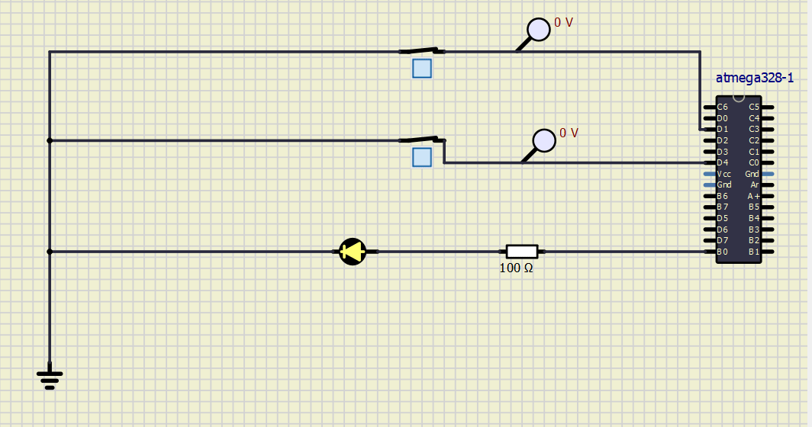

# Embedded_Project By Ashrika Mishra (260267)

## Heat Control System

### CI and Code Quality
|Build|Cppcheck|Codacy|
|:--:|:--:|:--:|
||

### Theory
The heat control system is basically used to control the temperature of a car seat. When a user or driver of the car gets seated on a car, the button sensor gets activated. After that, the user gets access to turn on the heater. The temperature sensor keeps monitoring the temperature and sends the analog value to the microcontroller. The microcontroller processes the analog input of the temperature sensor and outputs a temperature value through serial communication. All the activities of the control system are done on a microcontroller called Atmega328.

## Simulation
### Activity 1
#### Case 1 [1,1] :: LED GLOWS

#### Case 2 [0,1] :: LED DOESN'T GLOW

#### Case 3 [1,0] :: LED DOESN'T GLOW

#### Case 4 [0,0] :: LED DOESN'T GLOW 

### Activity 2

### Activity 3

### Activity 4

